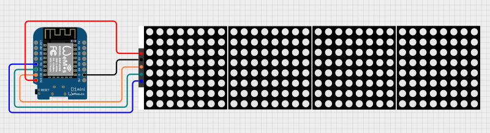

**ESPTimeCast** is a WiFi-connected LED matrix clock and weather station based on ESP8266 and MAX7219.  
It displays the current time, day of the week, and local weather (temp/humidity/weather description) fetched from OpenWeatherMap.  
Setup and configuration are fully managed via a built-in web interface.  

 

Get the 3D printable case!

---

## ✨ Features

- **LED Matrix Display (8x32)** powered by MAX7219, with custom font support
- **Simple Web Interface** for all configuration (WiFi, weather, time zone, display durations, and more)
- **Automatic NTP Sync** with robust status feedback and retries
- **Weather Fetching** from OpenWeatherMap (every 5 minutes, temp/humidity/description)
- **Fallback AP Mode** for easy first-time setup or configuration
- **Timezone Selection** from IANA names (DST integrated on backend)
- **Get My Location** button to get your approximate Lat/Long.
- **Week Day and Weather Description display** in multiple languages
- **Persistent Config** stored in LittleFS, with backup/restore system
- **Status Animations** for WiFi connection, AP mode, time syncing.
- **Advanced Settings** panel with:
  - Custom **Primary/Secondary NTP server** input
  - Display **Day of the Week** toggle (default is on)
  - **24/12h clock mode** toggle (24-hour default)
  - **Imperial Units (°F)** toggle (metric °C defaults)
  - Show **Humidity** toggle (display Humidity besides Temperature)
  - **Weather description** toggle (displays: heavy rain, scattered clouds, thunderstorm etc.)
  - **Flip display** (180 degrees)
  - Adjustable display **brightness**
  - Dimming Hours **Scheduling**
    
---

## 🪛 Wiring

 Note: although the pins are labeled differently in the V4, the positions are the same as the V3.x

**Wemos D1 Mini (ESP8266) → MAX7219**

| Wemos D1 Mini (v3.x) | Wemos D1 Mini (v4.0) | MAX7219 |
|:-------------:|:-------:|:-------:|
| GND           | GND     | GND     |
| D6            | 12      | CLK     |
| D7            | 13      | CS      |
| D8            | 15     | DIN     |
| 3V3           | 3V3     | VCC     |

Note: Thanks to @Wood578Guy for the Wiring diagram and the info on V4

---

## 🌐 Web UI & Configuration

The built-in web interface provides full configuration for:

- **WiFi settings** (SSID & Password)
- **Weather settings** (OpenWeatherMap API key, City, Country, Coordinates)
- **Time zone** (will auto-populate if TZ is found)
- **Day of the Week and Weather Description** languages
- **Display durations** for clock and weather (milliseconds)
- **Advanced Settings** (see below)

### First-time Setup / AP Mode

1. Power on the device. If WiFi fails, it auto-starts in AP mode:
   - **SSID:** `ESPTimeCast`
   - **Password:** `12345678`
   - Open `http://192.168.4.1` or `http://setup.esp` in your browser.
2. Set your WiFi and all other options.
3. Click **Save Setting** – the device saves config, reboots, and connects.
4. The device shows its local IP address after boot so you can login again for setting changes

*External links and the "Get My Location" button require internet access.  
They won't work while the device is in AP Mode - connect to Wi-Fi first.

### UI Example:

---

## ⚙️ Advanced Settings

Click the **cog icon** next to “Advanced Settings” in the web UI to reveal extra configuration options.  

**Available advanced settings:**

- **Primary NTP Server**: Override the default NTP server (e.g. `pool.ntp.org`)
- **Secondary NTP Server**: Fallback NTP server (e.g. `time.nist.gov`)
- **Day of the Week**: Display Day of the Week in the desired language
- **24/12h Clock**: Switch between 24-hour and 12-hour time formats (24-hour default)
- **Imperial Units (°F)** toggle (metric °C defaults)
- **Humidity**: Display Humidity besides Temperature
- **Weather description** toggle (display weather description in the selected language* for 3 seconds or scrolls once if description is too long)
- **Flip Display**: Invert the display vertically/horizontally
- **Brightness**: 0 (dim) to 15 (bright)
- **Dimming Feature**: Start time, end time and desired brightness selection 

*Non-English characters converted to their closest English alphabet.  
Tip: Don't forget to press the save button to keep your settings

---

## 📝 Configuration Notes

- **OpenWeatherMap API Key:**
   - [Make an account here](https://home.openweathermap.org/users/sign_up)
   - [Check your API key here](https://home.openweathermap.org/api_keys)
- **City Name:** e.g. `Tokyo`, `London`, etc.
- **Country Code:** 2-letter code (e.g., `JP`, `GB`)
- **ZIP Code:** Enter your ZIP code in the city field and US in the country field (US only)
- **Latitude and Longitude** You can enter coordinates in the city field (lat.) and country field (long.)
- **Time Zone:** Select from IANA zones (e.g., `America/New_York`, handles DST automatically)

---

## 🚀 Getting Started

1. **Clone this repo**
2. **Flash the ESP8266** using Arduino IDE or PlatformIO (Flash size "4MB FS:2MB OTA:~1019KB")
4. **Upload `/data` folder** with LittleFS uploader (see below)

### Board Setup

- Install ESP8266 board package:  
  `http://arduino.esp8266.com/stable/package_esp8266com_index.json`
- Select **Wemos D1 Mini** (or your ESP8266 variant) in Tools → Board
- Select Flash Size "4MB FS:2MB OTA:~1019KB" under Tools

### Dependencies

Install these libraries (Library Manager / PlatformIO):

- `ArduinoJson` by Benoit Blanchon
- `MD_Parola / MD_MAX72xx` all dependencies by majicDesigns
- `ESPAsyncTCP` by ESP32Async
- `ESPAsyncWebServer` by ESP32Async

### LittleFS Upload

Install the [LittleFS Uploader](https://randomnerdtutorials.com/arduino-ide-2-install-esp8266-littlefs/).

**To upload `/data`:**

1. Open Command Palette:
   - Windows: `Ctrl+Shift+P`
   - macOS: `Cmd+Shift+P`
2. Run: `Upload LittleFS to ESP8266`

**Important:** Serial Monitor **must be closed** before uploading!

---

## 📺 Display Behavior

**ESPTimeCast** automatically switches between two display modes: Clock and Weather.
If "Show Weather Description" is enabled a third mode (Description) will display with a duration of 3 seconds, if the description is too long to fit on the display the description will scroll from right to left once.

What you see on the LED matrix depends on whether the device has successfully fetched the current time (via NTP) and weather (via OpenWeatherMap).  
The following table summarizes what will appear on the display in each scenario:

| Display Mode | 🕒 NTP Time | 🌦️ Weather Data | 📺 Display Output                              |
|:------------:|:----------:|:--------------:|:--------------------------------------------|
| **Clock**    | ✅ Yes      | —              | 🗓️ Day Icon + ⏰ Time (e.g. `@ 14:53`)           |
| **Clock**    | ❌ No       | —              |  `! NTP` (NTP sync failed)               |
| **Weather**  | —          | ✅ Yes         | 🌡️ Temperature (e.g. `23ºC`)                |
| **Weather**  | ✅ Yes      | ❌ No          | 🗓️ Day Icon + ⏰ Time (e.g. `@ 14:53`)           |
| **Weather**  | ❌ No       | ❌ No          |  `! TEMP` (no weather or time data)       |

### **How it works:**

- The display automatically alternates between **Clock** and **Weather** modes (the duration for each is configurable).
- If "Show Weather Description" is enabled a third mode **Description** will display after the **Weather** display with a duration of 3 seconds.
- In **Clock** mode, if NTP time is available, you’ll see the current time plus a unique day-of-week icon. If NTP is not available, you'll see `! NTP`.
- In **Weather** mode, if weather is available, you’ll see the temperature (like `23ºC`). If weather is not available but time is, it falls back to showing the clock. If neither is available, you’ll see `! TEMP`.
- All status/error messages (`! NTP`, `! TEMP`) are big icons shown on the display.

**Legend:**
- 🗓️ **Day Icon**: Custom symbol for day of week (`@`, `=`, etc.)
- ⏰ **Time**: Current time (HH:MM)
- 🌡️ **Temperature**: Weather from OpenWeatherMap
- ✅ **Yes**: Data available
- ❌ **No**: Data not available
- — : Value does not affect this mode

---

## ☕ Support this project

If you enjoy this project, please consider supporting my work:

